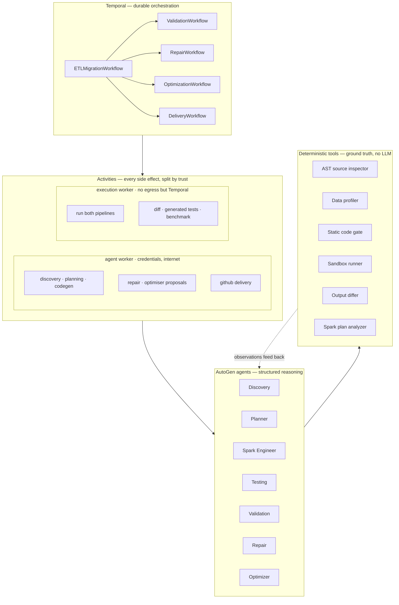
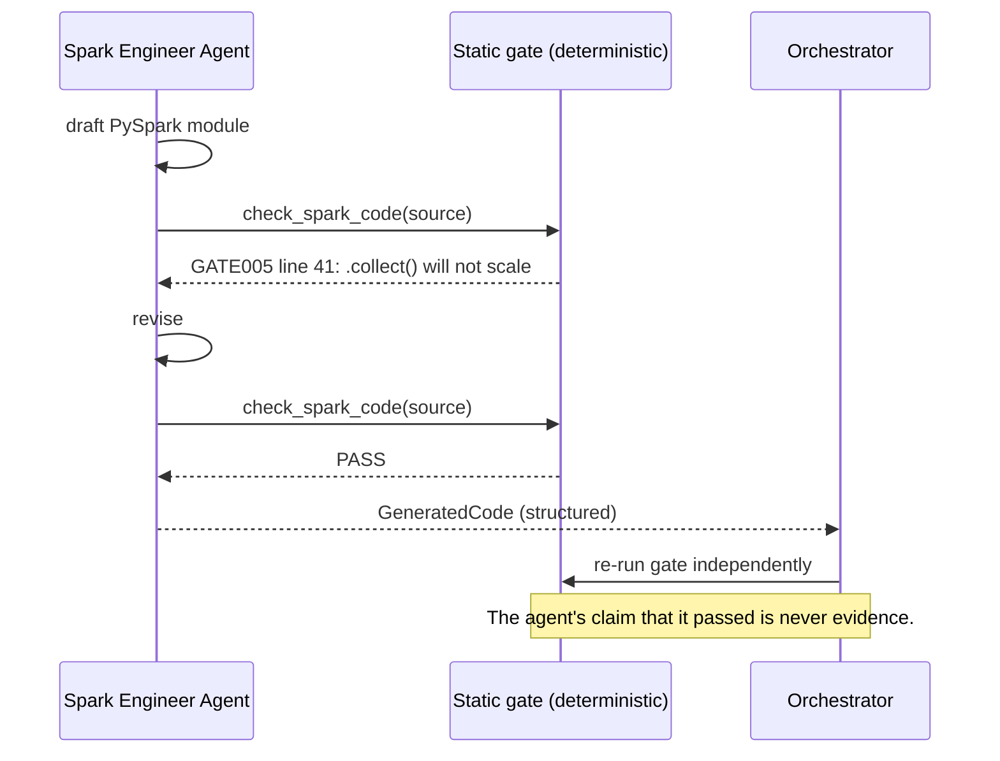

# Autonomous ETL Migration Agent

Migrates legacy ETL pipelines (pandas, SQL, shell) into **validated**, optimised
PySpark, using a team of AutoGen agents whose every conclusion is checked
against deterministic tools, orchestrated durably by Temporal, and shipped
through GitHub Actions to Kubernetes.

> **Status: complete and runnable.** A migration runs end to end to a
> *measured* verdict and then to a pull request: discovery → planning → human
> approval → PySpark generation → static gate → **both pipelines executed in a
> sandbox, a generated pytest suite run, and the two outputs diffed** →
> autonomous repair when they differ → **benchmarked optimisation kept only if
> it measures faster and still validates** → **a PR whose evidence is rendered
> from measurements and whose prose is audited against them**. It works as a
> local in-process pipeline and as a durable Temporal workflow with
> `ValidationWorkflow`, `RepairWorkflow`, `OptimizationWorkflow` and
> `DeliveryWorkflow` children, and ships as two non-root container images built
> and scanned by CI, deployed as two workers split by trust so the one that
> executes generated code has **no internet egress at all**, exports Prometheus
> metrics derived from the same record the PR renders from, and learns from
> completed migrations, reporting "not enough evidence" rather than a number
> until it has some. **All ten phases are complete.** Nothing in this README is
> design rather than code.

---

## Project Overview

The premise most "AI code migration" projects get wrong is that translation is
the hard part. It isn't. An LLM will happily turn `df.groupby("country").sum()`
into `df.groupBy("country").agg(...)` all day. The hard part is that **the
translation is silently wrong** in ways that surface months later in a
production number that nobody can explain:

- pandas `groupby` drops null keys by default. Spark `groupBy` keeps null as its
  own group. Same code, different row count, no error.
- pandas `merge` preserves left-frame order. Spark `join` does not. Any
  positional comparison of the two outputs is meaningless.
- pandas `sum()` of an all-NaN group returns `0.0`. Spark returns `null`.

So this system is built around an inversion:

> **The generated code is a hypothesis. The system's job is to prove or
> disprove it against real data, and to repair itself when the proof fails.**

The LLM never gets a vote on whether a migration is correct. Only the differ
does, after both pipelines have actually executed.

---

## Architecture

Three layers with a strict, enforced separation of concerns.

| Layer | Owns | Must never |
|---|---|---|
| **Perception**, deterministic tools | AST parsing, data profiling, static gates, sandboxed execution, output diffing, benchmarking | Involve an LLM |
| **Reasoning**, AutoGen agents | Interpretation, mapping decisions, repair strategy, optimisation hypotheses | Assert a fact it did not observe through a tool |
| **Orchestration**, Temporal | Durable state, retries, the repair loop, human approval, resumption | Perform heavy I/O or anything non-deterministic |



### Why this shape

**Why AutoGen?** The work is not one prompt, it is a loop: draft code → run the
static gate → read real findings → revise → re-check. AutoGen's `AssistantAgent`
gives that loop natively (`tools=`, `max_tool_iterations=`) *and* pins the
answer to a Pydantic type (`output_content_type=`), so the boundary between
agents is a validated schema rather than parsed prose. It also gives one
`ChatCompletionClient` interface across providers, which is what lets the whole
test suite run offline against recorded responses through the real agent code
path.

**Why Temporal?** A migration is a long, failure-prone, multi-stage process with
a human approval gate in the middle. Two properties make Temporal the right
tool rather than a nice-to-have: (1) a migration that fails at benchmarking must
resume at benchmarking, not re-run discovery and re-pay for the LLM calls;
(2) a HIGH-risk migration must be able to wait days for a human signal and
survive a worker restart while waiting. Cron plus a state table gets you neither
without reimplementing Temporal badly.

**Why PySpark?** It is the target the legacy pipelines are being migrated *to*, since
pandas breaks at single-machine memory limits. It also matters that Spark
reports on its own execution: the Optimizer agent reads real job, stage and task
counts from `statusTracker()` alongside real wall-clock timings, so its proposals
are grounded in measurements rather than in generic advice about broadcast joins.
(It does *not* read `explain()`; see [Spark Optimization](#spark-optimization)
for why that source was rejected rather than approximated.)

**Why Kubernetes?** Migration stages have wildly different resource profiles.
Agent workers are IO-bound and cheap; Spark executors are memory-hungry and
bursty. Kubernetes lets those scale independently and lets a Spark job that OOMs
be an isolated pod failure that Temporal retries, not a crashed orchestrator.

**Why CI/CD?** The system's output is a pull request containing generated code.
Generated code that is not linted, type-checked, security-scanned and tested by
the same pipeline as hand-written code is not production code. CI is what makes
the agent's output subject to the same standard as a human's.

**Why multi-agent rather than one agent?** Because each stage has a *different
success criterion*, and merging them corrupts all of them. Discovery is rewarded
for completeness, the Engineer for executable code, Validation for finding
differences, the Optimizer for speed. Fuse the Engineer and the Validator into
one context and the entity that wrote the code also grades it, precisely the
conflict of interest that produces confidently-broken migrations. Keeping them
separate makes the Validation agent an *adversary* of the Engineer agent, and
their disagreement is settled by the differ, not by whichever one is more
fluent.

---

## Agent Architecture

Every agent obeys the same contract, enforced by `StructuredAgent`
(`src/etl_migrator/agents/base.py`):

```text
Input → Reasoning → Structured Decision → Tool Invocation → Observable Result
```

- the answer is a **validated Pydantic model**, never free text;
- **every tool call is recorded**, "did it actually look?" has an answer, in
  `artifacts/<id>/agent_trace.json`;
- a contract violation raises `AgentContractError`, which Temporal treats as
  retryable rather than degrading silently.

| Agent | Input → Output | Real tools it must call | Phase |
|---|---|---|---|
| **Discovery** | source file → `MigrationSpec` | `inspect_legacy_source` (AST), `profile_input_data` (reads real files), `read_source_lines` | 1 ✅ |
| **Planner** | `MigrationSpec` → `MigrationPlan` | `lookup_migration_pattern`, `get_transformation`, `dataset_sizes` | 1 ✅ |
| **Spark Engineer** | `MigrationPlan` → `GeneratedCode` | `check_spark_code` (the static gate), `get_plan_step` | 1 ✅ |
| **Testing** | plan + spec → `GeneratedTests` | `check_test_code` (test gate), `read_generated_pipeline` | 3 ✅ |
| **Data Validation** | failing `ValidationReport` → `ValidationDiagnosis` | `get_validation_report`, `get_failed_check`, `get_plan_step` | 3 ✅ |
| **Repair** | failure + diagnosis → `RepairProposal` | `get_failure`, `get_current_code`, `previous_attempts`, `check_spark_code` | 4 ✅ |
| **Optimizer** | measured baseline + plan analysis → `OptimizationProposal` | `get_baseline`, `analyze_current_plan`, `get_current_code`, `previous_attempts`, `check_spark_code` | 5 ✅ |
| **Delivery** | `MigrationRecord` → `PullRequestNarrative` | `get_migration_facts`, `get_generated_code`, `get_semantic_differences`, `check_claims` | 6 ✅ |

Note what the Discovery agent is **not** given: the source text in its prompt.
It is given tools and must call them. An agent handed 200 lines of pandas will
confidently describe columns that do not exist; an agent that has to call
`inspect_legacy_source()` gets line-numbered facts it cannot invent. That
distinction is the difference between a demo and a system.

The Spark Engineer's loop is the clearest example of genuine agentic behaviour
in the codebase, and it happens inside a single invocation:



---

## Temporal Workflow

```mermaid
stateDiagram-v2
    [*] --> Discovery
    Discovery --> Planning
    Planning --> AwaitApproval: overall_risk == HIGH
    AwaitApproval --> Generation: signal approve
    AwaitApproval --> Rejected: signal reject
    Planning --> Generation: risk < HIGH
    Generation --> StaticGate
    StaticGate --> TestGeneration
    TestGeneration --> Validation
    Validation --> Optimization: PASS
    Validation --> Repair: FAIL
    Repair --> Validation: attempt < max_attempts
    Repair --> NeedsHuman: attempts exhausted
    Optimization --> Delivery
    Repair --> Delivery: exhausted (draft PR)
    Delivery --> PullRequest: policy allows
    Delivery --> NoPullRequest: refused / claims unsupported
    PullRequest --> HumanReview --> [*]
    NoPullRequest --> [*]
    Rejected --> [*]
    NeedsHuman --> [*]
```

- `ETLMigrationWorkflow` is the parent and sole holder of durable state
  (`MigrationRecord`). `Validation`, `Repair`, `Optimization` and `Delivery`
  attach as **child workflows**, so each gets its own retry budget, its own
  timeouts, and its own row in the Temporal UI.
- **Delivery runs on every exit path**, including failure. It hangs off
  `_finish`, not off a success branch. A failed migration still produces work
  worth showing a human, as a labelled draft; deciding which is
  `decide_delivery`'s job, not the workflow's.
- **Signals:** `approve(ApprovalDecision)`, `abort(reason)`.
  **Queries:** `status()` (cheap, pollable), `report()` (the full record), a UI
  reads live state without touching a database.
- Approval uses `workflow.wait_condition(...)` with a deadline, so a migration
  can sit pending for days and survive worker restarts. Nobody answering is a
  *terminal* outcome, not a retry, re-asking a silent human yields the same
  silence.
- **The migration id is the workflow id**, so resubmitting the same migration
  attaches to the running execution rather than paying for a second set of LLM
  calls.
- **Determinism is enforced, not hoped for.** Every LLM call, file read, Spark
  job and HTTP request is an Activity. Workflows run in Temporal's sandboxed
  runner; only `etl_migrator.domain` is passthrough, safe precisely because
  that package imports nothing but pydantic and the stdlib, which a test
  asserts. All state mutation lives in `domain/lifecycle.py` as pure functions
  taking `now` explicitly, so there is no clock in workflow code to reach for.

Shipped activities (16): `analyze_legacy_pipeline`, `generate_migration_plan`,
`generate_spark_code`, `run_static_analysis`, `persist_artifacts`,
`run_legacy_pipeline`, `run_spark_pipeline`, `validate_outputs`,
`generate_tests`, `run_tests`, `diagnose_validation_failure`, `propose_repair`,
`benchmark_spark`, `propose_optimization`, `propose_pr_narrative`,
`deliver_pull_request`.
Planned: `deploy_to_kubernetes`, `verify_deployment`.

A test asserts this registry matches the `@activity.defn` callables exactly, so
the list cannot drift from the code.

### Retry policy per activity class

| Class | Policy |
|---|---|
| LLM-backed (discovery, planning, codegen) | exponential backoff, 4 attempts, 10-minute timeout |
| Deterministic local (gate, persist) | 3 attempts, 2-minute timeout |
| Pipeline execution | 2 attempts, a Spark job that OOMs twice will OOM a third time |
| Benchmarks | 2 attempts, 1-hour timeout, each is several full executions, so a retry costs minutes |
| Never retried | `ConfigurationError`, `UnsupportedSourceError`, `ScriptExhaustedError`, retrying a missing API key four times only costs four timeouts |
| Deliberately retried | `AgentContractError`, a malformed model response often succeeds on a second sample |

---

## Migration Lifecycle

```mermaid
flowchart LR
    L["Legacy pipeline"] --> D["Discovery"] --> P["Planning"] --> A{"HIGH risk?"}
    A -->|yes| H["Human approval<br/>(Temporal signal)"] --> C
    A -->|no| C["PySpark generation"]
    C --> S["Static gate"] --> T["Test generation"]
    T --> X1["Execute legacy"] & X2["Execute Spark"]
    X1 & X2 --> V{"Equivalent?"}
    V -->|no| R["Autonomous repair"] --> V
    V -->|yes| B["Benchmark baseline"] --> O["Propose optimisation"]
    O --> RV["Re-validate in full"] --> M{"Measurably faster<br/>and still correct?"}
    M -->|no| RB["Revert"] --> DL
    M -->|yes| KP["Keep"] --> DL{"Earned a PR?"}
    R -.->|exhausted| DL
    DL -->|"validated"| PR["Pull request"]
    DL -->|"failed"| DR["Draft + needs-human"]
    DL -->|"never validated"| NO["No PR"]
    PR --> HR["Human review"]
```



---

## Autonomous Repair

Validation failure is a normal state, not a terminal one.

```text
Validation FAIL
      ↓
Root cause analysis   ← the differ's measurements, not the LLM's guess
      ↓
Repair proposal       ← must be a distinct strategy, enforced by the ledger
      ↓
Static gate → re-execute both pipelines → re-validate
      ↓
PASS, or the next attempt
```

**`RepairLedger` is what makes the attempt budget mean something.** A strategy
is identified by `(root cause category, approach slug)`, for example
`null_semantics:filter_null_group_keys`. Proposing a signature already tried is
rejected outright, as is code whose content hash (comments stripped) matches an
earlier attempt. Both checks are set-membership tests: no LLM call, no Spark
run. Without them, "three attempts" means "three executions", which an
oscillating agent happily spends on two ideas.

The rejection is fed into the next prompt, so the agent observes that its idea
was spent, and a rejected proposal still consumes an attempt, because an agent
that cannot produce a distinct strategy has run out of them.

Here is the loop on the `customer_pipeline_broken` scenario, where the engineer
emits code that is **gate-clean but semantically wrong in two ways**:

```text
  repair          : SUCCEEDED
      attempt 1 [null_semantics:filter_null_group_keys]: validation FAIL (1 differences)
      attempt 2: REJECTED — strategy 'null_semantics:filter_null_group_keys' was already
                 tried and did not fix the failure; a different root-cause approach is required
      attempt 3 [index_semantics:drop_synthesised_index]: validation PASS (0 differences)
```

The repaired code is byte-identical to the implementation already proved
correct, and a test asserts that.

Exhausting the budget is an outcome, not a crash: `RepairOutcome` carries every
attempt and identifies the **nearest miss** by measured difference count,
because when a human takes over they need the closest attempt rather than the
last one, the final attempt is often a wilder guess than the second.

---

## Data Validation

Both pipelines execute **in a sandbox**, against the same input, and their
outputs are compared on: schema · row count · null counts per column · column
statistics · aggregate checksums · duplicate counts · sample records ·
configurable numeric tolerance.

```json
{
  "status": "PASS",
  "schema_match": true,
  "row_count_match": true,
  "numeric_tolerance_passed": true,
  "differences": []
}
```

Four properties make this worth trusting:

**The differ is the only thing that may say PASS.** `ValidationReport.status` is
a computed property over measured checks: there is no setter, and no agent can
construct one. The Validation *agent* is only ever built when the status is
already FAIL; its constructor raises otherwise, and `ValidationDiagnosis` has no
field capable of expressing a verdict. The model interprets evidence; it never
gets to be evidence.

**A check that could not run is not a pass.** Declared join keys missing from
the output, or a check name the differ does not implement, produce `skipped`,
which maps to ERROR. Treating "we did not measure it" as "it is fine" is exactly
how silently-wrong migrations ship.

**Row order is never assumed.** Comparisons are key-joined, or sorted, and fall
back to sorted rows when keys turn out non-unique, because joining on a
non-unique key multiplies rows and would report a difference that is an artefact
of the comparison rather than of the data.

**The criteria are fixed before the code exists.** The Planner writes
`ValidationPlan` during planning, and every `SemanticDifference` it declares
*adds* a required check (`MigrationPlan.effective_required_checks()`). A planner
that stays silent about null semantics produces a weaker suite, and the
difference surfaces as a real diff later. Silence is not free.

### Generated tests

The Testing agent writes a pytest suite that is a genuinely different instrument
from the differ. The differ compares whole outputs after both pipelines ran; the
tests pin individual behaviours on small hand-built frames, an empty group, an
all-null column, a duplicated key. That is where the sample data may simply
not contain the trap.

On the worked example the agent produces seven tests, one per declared semantic
difference. Against the correct pipeline all seven pass; against a pipeline with
the null-key mitigation removed, two fail. A suite that passes against anything
would be worse than none, so `test_validation_e2e.py` asserts both directions.

The harness supplies `spark`, `pipeline` and `input_dir` fixtures rather than
letting generated tests build a session. That keeps Spark configuration under
the optimizer's control, and stops a test quietly running against a different
config than the one that was validated. That matters for optimisation: when
the optimiser changes the Spark configuration, the re-validation runs against
the *new* configuration, which is the only way the correctness check means
anything.

---

## Spark Optimization

Runs only after correctness is established, and never trusts the model:

```text
benchmark(baseline) → propose → static gate → re-validate in full
    → benchmark(candidate) → evaluate_optimization → keep or revert
```

`make demo-optimize` runs it. The `customer_pipeline_slow` scenario records a
planner that emits a deliberately naive Spark configuration, AQE disabled, a
static 200 shuffle partitions, for a 230 KB input that groups into five
countries. Real output from a real run:

```text
  validation      : PASS
  optimisation    : 1.38x applied
      baseline: median=14.805s p75=14.966s noise=0.9% over 8 run(s)
                [jobs=3 stages=6 tasks=408 shuffle_partitions=200 aqe=False]
      candidate1: median=10.712s p75=11.485s noise=16.0% over 8 run(s)
                [jobs=5 stages=9 tasks=9 shuffle_partitions=8 aqe=True]
      attempt 1 [enable_adaptive_coalescing]: accepted: 1.38x faster, validation still PASS
      agent expected 1.50x, measured 1.38x
```

Note the last line. The agent claimed 1.50x; it got 1.38x. The claim is
recorded precisely so it can be compared against the measurement. It is never
an input to the decision.

### The acceptance rule

`applied` is a conjunction of measured facts, computed by
[`evaluate_optimization`](src/etl_migrator/domain/optimization.py), a pure
function over a `ValidationReport` and a `BenchmarkComparison`. No field on any
agent output can set it. Four conditions, checked in this order:

| # | Condition | Why it is not negotiable |
|---|---|---|
| 1 | Validation still **PASS**, re-run in full | An optimisation that changes the output is a regression with a stopwatch attached. Checked *before* the candidate is timed, so a wrong answer never gets benchmarked. |
| 2 | The measurement is **conclusive** | Noise below a 25% ceiling, at least two samples, neither side failed. Refusing to answer is the correct response to an unmeasurable question. |
| 3 | The gain is **robust** | The candidate's p75 must beat the baseline's median, so a single lucky run cannot carry the verdict. |
| 4 | The speedup clears **`min_speedup`** (default 1.10) | Below that the change is not worth the review burden even if it is real. |

The order is the argument: correctness is not traded against speed at any
exchange rate, so it is settled before the stopwatch is consulted at all.

### Two things this cost, and what they taught

Both were found by running the thing, and both are worth stating because they
are the failure modes the phase exists to prevent.

**The default sample size was too small.** The first version timed four runs per
configuration. On the example workload that repeatedly returned
`INCONCLUSIVE`: the candidate's noise measured 36.8%, far above the ceiling, so
nothing could be accepted. The identical comparison at eight samples reported
4.0% noise and a robust 1.19x. The speedup had been there all along, four
samples could not see past their own error bar, because with n=4 one slow run
dominates the deviation. **The fix for an unmeasurable result is more
measurement, never a laxer threshold.** Raising the noise ceiling until the
four-run comparison passed would have produced the same headline number on
evidence that did not support it.

**The noise estimator disagreed with the robustness check.** A later run came
back as seven timings within a second of each other and one at 20.2s, because
something else on the machine wanted the CPU. A standard deviation reads that
sample as 35% noise and throws away seven good measurements on account of one
bad one, while the robustness check, which reads the p75, was untroubled by
the same outlier. Two estimators, two conclusions, same data. `noise_ratio` now
uses the scaled median absolute deviation, which is resistant to a minority of
interrupted runs and reports the outlier count alongside. This is not a
loosened threshold, and the test suite pins the difference: timings that
disagree with *each other* rather than one disagreeing with the rest still
measure as noisy and are still refused.

### What it reads, and what it refuses to claim

The Optimizer agent has the least authority of any agent in the system. Its
inputs are all measurements:

- **`get_baseline`**: the timings, their noise ratio, and Spark's own job,
  stage and task counts from `statusTracker()`.
- **`analyze_current_plan`**, an AST analysis reporting structural
  opportunities with line numbers: `coalesce(1)`, `repartition(1)`, `distinct()`,
  Python UDFs, uncached DataFrames read three or more times, and broadcast
  candidates grounded in *measured* file sizes.

PySpark does not reliably expose a physical plan for a pipeline whose entrypoint
writes and returns nothing, and stage-level shuffle byte counts need a JVM
listener. Rather than estimate those and present the estimates as measurements,
the analyser reports what can actually be established from the code's structure,
and `SparkRunMetrics` reports what Spark actually said. Two honest sources beat
one overreaching one.

The analyser reports nothing on already-optimised code, and there is a test that
asserts exactly that. An analyser that always finds something is an analyser
that tells you nothing, and it pushes the optimiser into inventing work. The
agent has a `no_change` escape hatch for the same reason: declining is a valid
answer and costs nothing.

---

## Pull Request Generation

The migration's output is a pull request containing generated code. Two things
about that are easy to get wrong, and both are decided by code rather than by a
prompt.

### Not every migration earns one

`decide_delivery` is a pure function over the `MigrationRecord`, and the agent
has no input to it:

| Record state | Outcome | Why |
|---|---|---|
| Validation **PASS** | PR, labelled `autonomous-etl` (+ `high-risk`, `optimised`) | Correctness was established by executing both pipelines |
| Validation **never ran** | **Refused**, no branch, no agent call, nothing | Code that was never executed is a hypothesis. A PR asks a reviewer to approve it, and they cannot tell it apart from one that was checked |
| Validation **FAIL**/**ERROR**, repair did not recover | **Draft** + `needs-human`, failure stated in the body | Hiding it wastes the work; a normal PR invites an approval. A draft asking for help is the honest third option |
| Migration failed outright | **Draft** + `migration-failed` | Same reasoning |
| No code generated | **Refused** | There is nothing a reviewer could do |

The refusal is the load-bearing case, and the e2e suite proves it: the same
fixture with validation switched off opens no PR **and creates no branch**.

### The body has two halves, and only one is written by an agent

```text
┌─ agent-authored ────────────────────────────────────────┐
│  summary · "what a reviewer must accept" · where to look │  ← audited
├─ rendered from the MigrationRecord ─────────────────────┤
│  validation verdict + every check · measured speedup     │  ← no LLM involved
│  semantic differences · repair history · provenance      │
└──────────────────────────────────────────────────────────┘
```

A PR body is the artefact a reviewer reads first and often the only one they
read closely, so it is exactly where an overstated claim does the most damage.
`PullRequestNarrative` therefore has no field for a verdict, no
`validation_status`, no `speedup`: because those come from measurements, and a
reviewer should never have to work out which of two disagreeing accounts is
real. A test asserts the structural version of this: two narratives, one honest
and one claiming everything passed, produce a **byte-identical** evidence block.

### Numbers in the prose are checked against the record

`audit_numeric_claims` extracts numeric claims, speedups, check tallies, row
counts, attempt counts, and requires each to appear in the set of figures the
migration actually measured. That set is *derived from the record*, never
configured, so the audit cannot drift into a list of numbers somebody once
decided were fine.

```text
claims: FAIL
  [speedup] claims 3; the record supports 1.00, 1.25, 1.50 — in: "The optimised pipeline is 3x faster than the original."
```

A failure sends the specific violations back to the agent for a bounded number
of revisions. If the prose still cannot be made to match the measurements, **no
PR is opened**, publishing it with a disclaimer is not one of the options, and
a structural test asserts the delivery call sits inside the `audit.passed`
branch.

The audit is deliberately narrow. It matches numbers in claim contexts only, so
"Python 3.11" and "2 CSV files" pass without comment; an audit that argued with
those would be noise, and noise gets switched off. It does catch `1.4×` as well
as `1.4x`, because an audit that only reads ASCII is one keystroke from useless.

### Every write is idempotent

A Temporal activity can be retried after its side effect has landed, the worker
dies between the API call succeeding and the result being recorded. So every
write is lookup-then-create: `ensure_branch` reports `created=False` when it
finds one and **never force-moves** a branch a reviewer may already be reading,
`ensure_file` reads the existing blob sha so a create becomes an update instead
of a 409, and `ensure_pull_request` finds the open PR rather than opening a
second, without rewriting a body someone may have commented on.

That is tested against `InMemoryGitHub`, which is not a stub returning canned
success, a stub would let a client that skipped its lookup sail through. It
models state and returns what real GitHub returns: 422 for a duplicate ref, 422
for a create over an existing path with no sha, 409 for a stale sha, 422 for a
second PR from one head. A `TestTheFakeIsUnforgiving` class asserts the fake
would have punished the naive implementation, so the idempotency tests are not
theatre.

Endpoint shapes were verified against the live API rather than recalled.

---

## Containers and CI/CD

### Two images, because only one of them needs a JVM

| Target | Contents | Used for |
|---|---|---|
| `cli` | Python only | Generation, inspection, PR delivery |
| `worker` | + JRE 17 + PySpark | Temporal worker: executes both pipelines, diffs, benchmarks |

A JRE and PySpark are several hundred megabytes that the generation path never
touches, and the CLI is the image you would run in a short-lived job or a
developer's shell.

Both build from a shared `base` stage so their dependency sets are identical.
A worker whose pydantic differs from the CLI's fails in ways that are miserable
to diagnose. Wheels are compiled in a `builder` stage and only the resulting
virtualenv is copied forward, so `build-essential` never ships in an image that
executes untrusted generated code.

Both run as **uid 10001, not root**. That is not decoration: the whole premise
of `sandbox/runner.py` is that generated code is untrusted, and spawning it from
a uid-0 process would hand back most of what the sandbox protects. CI asserts it
(`docker run --entrypoint id <image> -u`) rather than trusting the Dockerfile,
because a stray `USER root` at the end of a stage is a silent regression.

The worker also runs with a **read-only root filesystem** under compose, with
`cap_drop: ALL` and `no-new-privileges`. The only writable paths are a tmpfs at
`/tmp` (the JVM writes `hsperfdata` there) and the workspace volume, which is
also where `SPARK_LOCAL_DIRS` points.

```bash
make docker-build     # both images, exactly as CI builds them
make docker-smoke     # ...and prove they start, and are not root
docker compose --profile worker up -d    # run the worker as a container
```

### CI

`.github/workflows/ci.yml`, six jobs, parallel:

| Job | What it establishes |
|---|---|
| `static` | ruff over the tree, `mypy --strict` over `src` |
| `test` | the fast tier on **3.11 and 3.12**, both ends of `requires-python`, because the floor is where a 3.12-only construct shows up |
| `spark` | JVM + `[dev,spark]`, generates the input data, runs every tier that executes Spark for real |
| `integration` | a real Temporal server and Postgres as service containers: durable pause, approval, idempotency, replay determinism |
| `audit` | `pip-audit --strict` |
| `image` | builds both images, runs them, asserts non-root, scans both |

**CI needs no credentials at all.** `ETLM_LLM_PROVIDER=scripted` runs the real
agent loops against recorded responses, so there is no API key to leak, a fork's
pull request can run the whole suite, and a compromised runner has nothing to
steal. A test asserts `secrets.` never appears in `ci.yml`.

Every step has a local equivalent, `make lint`, `make typecheck`,
`make test-fast`, `make audit`, `make docker-smoke`, and a test asserts each of
those targets exists. A red build nobody can reproduce locally is a red build
nobody fixes.

`.github/workflows/release.yml` builds, **scans, and only then pushes** to GHCR
with build provenance attestation. Pushing first and scanning afterwards
publishes the vulnerability and then reports it. The workflow deliberately does
not deploy: `k8s/` is applied by whoever runs the cluster, and a CI step that
pretended to roll out would turn a missing capability into a green tick.

### Supply chain

Two decisions here came from a real incident rather than from a checklist.

**No `aquasecurity/trivy-action`.** In March 2026 an attacker force-pushed 75 of
its 76 version tags so that trusted references served an infostealer harvesting
CI/CD secrets from Actions runners ([GHSA-cxm3-wv7p-598c][trivy-adv]); the
`aquasec/trivy` images `0.69.4`–`0.69.6` and `latest` were compromised
alongside. Scanning is still wanted, so Trivy is installed from its apt
repository at a pinned version with a verified signing key. A test fails the
build if the action is ever reintroduced.

**Every action is allowlisted and pinned.** The lesson of that attack is that
the tags did not change *name*, they changed *content*. So `ALLOWED_ACTIONS` in
`tests/test_ci_workflows.py` names each third-party action and its version, and
a new one cannot be added without editing that list. It makes each dependency a
decision someone made on purpose.

`pip-audit` runs on every push and is not decorative: it found
**PYSEC-2026-1845** in pytest 8.4.2 the first time it ran here, and the
project's own `pytest>=8.3,<9` pin was excluding the fix.

[trivy-adv]: https://www.docker.com/blog/trivy-supply-chain-compromise-what-docker-hub-users-should-know/

### What is and is not verified

The CI configuration is checked by 47 tests in `tests/test_ci_workflows.py`:
the YAML parses, every action is pinned and allowlisted, no credential is
literal, no job holds write access it does not need, the tested Python versions
match `requires-python`, every marker is selected by some job, and both
Dockerfile stages end as a non-root user, with a guard-the-guard test proving
the root detector actually fires.

What those tests do **not** establish is that the workflows run or that the
images build; that needs GitHub and a Docker daemon, neither of which is
available where this was developed. `make docker-smoke` is the command that
answers it, and it is the first thing to run on a machine that has Docker.

---

## Kubernetes

This is where the sandbox's one stated gap closes.

The subprocess sandbox is explicit that it does **not** isolate the
network, blocking egress needs a network namespace and privileges the worker
does not have, and deferred it to the container boundary. Deferring it is only
honest if it eventually arrives, so here it is.

### The split is the mechanism, not the policy

A NetworkPolicy alone would not have helped. If one pod both calls a model
provider and executes generated code, that pod needs internet egress, and the
subprocess inherits exactly that. So the workers are split by trust:

| | `agent-worker` | `execution-worker` |
|---|---|---|
| Executes generated code | never | always |
| Model provider + GitHub credentials | yes | **none** |
| Egress | Temporal + 443 to the public internet | **Temporal only** |
| Service account token | not mounted | not mounted |
| Image | `…-cli` (no JVM) | `…-worker` (JRE 17) |
| Activities registered | 11 | 5 |

Generated code now runs in a pod with nowhere to send what it finds and nothing
to download.

The split is real in the code, not only in YAML. `WorkerRole.EXECUTION`
registers exactly five activities, the ones that execute untrusted code or read
its output, and a test walks the AST of `ValidationActivities` asserting that
none of them constructs a `StepContext`, which is the only way to reach a model
client. If that ever changed, the executing worker would need egress it does not
have, and the result would be a loud outage rather than a quiet hole.

The workflows have to cooperate too: `execution_task_queue` routes those five
activities to the isolated worker's queue, and a test reads the AST of every
call site to confirm none of them was left on the default queue. An unset queue
means "the workflow's own queue", so a laptop or `docker compose` runs
everything on one worker without opting out of anything.

### Least privilege

```yaml
securityContext:
  runAsNonRoot: true         # uid 10001, matching the Dockerfile
  readOnlyRootFilesystem: true
  allowPrivilegeEscalation: false
  capabilities: {drop: ["ALL"]}
  seccompProfile: {type: RuntimeDefault}
automountServiceAccountToken: false
```

The namespace enforces the **restricted** Pod Security Standard, so those are
admission-time requirements rather than promises a manifest makes to itself. No
Role is bound to either worker: they poll Temporal and write to a volume, and
neither needs the Kubernetes API. The executing pod in particular must not have
a projected token sitting in the filesystem of the container running untrusted
code.

The agent worker's 443 rule is necessarily broad, a NetworkPolicy selects on
pods and CIDRs, not hostnames, so what matters is the exclusions: RFC1918 and,
most importantly, `169.254.0.0/16`. On every major cloud, `169.254.169.254`
hands instance credentials to anything that asks.

### What is verified, and what is not

```bash
make k8s-validate    # kubeconform strict schema + the policy tests
```

`tests/test_kubernetes.py` runs strict schema validation against the published
Kubernetes schemas, which catches misspelled fields and wrong types, not just
malformed YAML, plus the policy checks above.

It does **not** establish that the manifests apply, that the pods reach Ready,
or that the CNI enforces the policies. That last one matters: kind's default CNI
silently ignores NetworkPolicy, so `k8s/kind/cluster.yaml` disables it and
`k8s/README.md` installs Calico. Applying these policies to a stock kind cluster
gives a green `kubectl get netpol` and zero enforcement, which is worse than not
applying them because it looks tested. `k8s/README.md` has the two `exec`
commands that actually prove the isolation holds.

Temporal, PostgreSQL and MinIO are deliberately not reimplemented here, they
have maintained upstream charts, and a hand-rolled copy would drift. `k8s/`
owns the part nobody else can write.

---

## Observability

Every metric is read off a finished `MigrationRecord`, the same object the PR
body renders from and the artifacts persist. So a dashboard and a pull request
cannot tell a reviewer different stories, and no agent can move a counter by
claiming something: `etl_optimization_speedup_ratio` is observed when
`OptimizationOutcome.applied` is true, and that field is set only by
`evaluate_optimization` from measured timings.

```bash
make observability-up     # Prometheus :9090, Grafana :3000, dashboard provisioned
```

Real output after one migration of the worked example:

```text
etl_validations_total{status="PASS"} 1.0
etl_validation_checks_total{check="numeric_tolerance",result="pass"} 1.0
etl_pipeline_execution_seconds_sum{engine="pandas"} 0.3357
etl_pipeline_execution_seconds_sum{engine="spark"} 30.8188
etl_stage_duration_seconds_sum{stage="validation"} 32.539752
etl_agent_tool_calls_total{agent="spark_engineer"} 2.0
etl_gate_submissions_total 2.0
etl_deliveries_total{disposition="ready"} 1.0
```

### What the dashboard is for

Twelve panels, and the interesting ones are the refusals:

| Panel | Why it is there |
|---|---|
| **Why optimisations were refused** | "Nothing was kept" has several very different causes. `rejected_inconclusive` climbing means the fleet's measurements are getting too noisy to read, and the fix is more benchmark runs, never a laxer threshold |
| **Benchmark noise vs the refusal ceiling** | The measurement's own error bar, plotted against the 0.25 line where a comparison is refused. This is the early warning, before verdicts start coming back inconclusive |
| **Repair attempts** | `refused` is the anti-oscillation ledger turning away a repeated strategy before it costs a Spark run. That is the loop's savings, not its failures |
| **Delivery dispositions** | `refused` means a migration was not allowed to become a PR, almost always because it was never validated. That is the policy working |
| **PR claim violations caught** | Numeric claims in agent prose the record did not support, caught before publication. A sustained rise means the delivery prompt is drifting |

Only *accepted* speedups are observed. A rejected proposal's ratio is a number
the system declined to believe, and averaging it in would report improvements
that were never kept, which is the benchmark theatre the optimiser exists to prevent.

### Cardinality is a design constraint, not an afterthought

A `migration_id` label adds a time series per migration and eventually takes
Prometheus down. Every label here draws from a bounded set, a stage enum, an
agent name, one of eight verdict classes, and a test sweeps a maximal record
through the registry asserting each emitted value falls inside its set. The id
belongs in the log line, where it already is on every entry, and in the
artifact.

The verdict labels are derived from the structured fields of an
`OptimizationAttempt`, never parsed out of its rendered prose. The prose is for
humans and gets reworded; a label that tracked it would silently fragment the
series the first time someone improved a sentence.

### Two operational details worth stating

**Counters are deduplicated per migration within a worker process.** Temporal
retries `persist_artifacts`, and without that a retry inflates every counter it
touches. That makes them exactly-once for a retry in the same process and
at-least-once across a worker restart, fine for rates and trends, not for
anything resembling an invoice.

**`/healthz` deliberately does not check Temporal.** A worker that cannot reach
Temporal is broken, but restarting it will not help, and a liveness probe that
failed during a Temporal outage would restart every replica simultaneously and
turn one outage into two. The metrics server also starts *before* the Temporal
connection, because an unreachable broker is exactly when you want to be able to
scrape the worker.

Adding the endpoint interacts with the network policies: the default-deny rule
blocks ingress as well as egress, so `k8s/base/20-networkpolicy.yaml` gained one
ingress rule, a single port, from the monitoring namespace only. It has no
egress section, so Prometheus reaching in does not widen what untrusted code can
reach out to.

### Verified

`tests/test_metrics.py` drives real records through the exporter and reads the
exposition format back, including a test that every PromQL query in the Grafana
JSON names a metric the code actually exports, a dashboard querying a renamed
metric renders "No data" for ever and reports nothing wrong. What is not
verified here is that Prometheus scrapes it or that Grafana renders it;
`make observability-up` is what answers that.

---

## Security

Generated code is treated as **untrusted input**, because that is what it is.

- **Layer one, the static gate** (`tools/code_gate.py`) is an *allowlist*:
  `pyspark` plus nine stdlib modules, not a blocklist, because a blocklist of
  dangerous imports is unbounded and an allowlist is auditable. It rejects
  `eval`/`exec`/`compile`/`open`/`__import__`, sandbox-escape attributes
  (`__globals__`, `__subclasses__`, …), relative imports, and any module-level
  statement that executes on import. Generated *tests* get their own profile:
  pytest permitted, `.collect()` allowed on tiny frames, while import purity
  stays enforced, because pytest collects a module by importing it.

- **Layer two, the sandbox** (`sandbox/runner.py`) runs generated code in a
  separate interpreter. Stated precisely, because an oversold security boundary
  is worse than an understood one:

  | Guaranteed | Not guaranteed |
  |---|---|
  | Process isolation, generated code cannot corrupt the worker or kill it with `sys.exit` | **Network egress.** Blocking it needs a network namespace, which needs privileges the worker does not have |
  | **A scrubbed environment**: an allowlist, so `ETLM_LLM_API_KEY`, `ETLM_GITHUB_TOKEN` and every other secret are absent | |
  | Resource limits (CPU, address space, file size, open files) and a wall-clock timeout that kills the whole process group | |
  | A neutral working directory, so a stray relative write cannot reach the repo | |
  | Verdicts read from a result file, not parsed from stdout, so generated code cannot print a forged success | |

  Network isolation belongs at the container boundary, and it is
  there: the worker that executes generated code is deployed with a default-deny
  egress policy whose only exception is the Temporal frontend, and it is a
  *separate* deployment from the one holding an API key precisely so that policy
  can be that narrow. See [Kubernetes](#kubernetes). The gate's import allowlist
  is what keeps a socket out of the code in the first place. Three independent
  layers, none pretending to be the others.
- **The GitHub token is read in exactly one place** (`github/client_from_settings`)
  and lives only on the workers that run delivery activities, those are their
  own class precisely so a deployment can keep the token off the Spark and agent
  workers. It is never logged: request logging records method, path and status.
  A worker without a token still starts and serves every other activity.
- **No hardcoded secrets.** All configuration is environment-driven via
  `pydantic-settings`; secrets are `SecretStr`. See `.env.example`.
- **Path traversal guarded** on every agent-supplied path.
- Container runs as non-root; dependency and image scanning in CI; least
  privilege Kubernetes RBAC *(phases 7–8)*.

---

## Local Setup

> **[docs/RUNBOOK.md](docs/RUNBOOK.md)** walks through all of this tier by tier,
> from "Python only, two minutes" up to Kubernetes, including how to kill a
> worker mid-migration and watch Temporal resume it, which is the one claim here
> that reading the code cannot settle.

Requires Python 3.11 or 3.12, both are tested in CI. A JVM is needed only to
*execute* Spark, for validation and benchmarking; code generation does not need
one. Docker is needed for the durable path and to build the images.

```bash
make check          # exactly what CI runs: lint, types, audit, full suite
make docker-smoke   # build both images and prove they start as non-root
```

```bash
git clone <this repo> && cd autonomous-etl
python -m venv .venv && source .venv/bin/activate
pip install -e ".[dev,spark]"    # or `make install-spark`. Without the spark
                                 # extra the 55 equivalence tests skip silently.

cp .env.example .env             # defaults to the offline scripted provider
python examples/customer_pipeline/generate_data.py --rows 2000
```

### Example Migration: local path

No server, no API key, no Docker:

```bash
etl-migrator migrate examples/customer_pipeline/legacy_pipeline.py
```

This runs the whole lifecycle, ending in a measured verdict:

```text
  gate            : PASS after 2 submission(s)
  validation      : PASS
      [  ok] schema: 2 reference columns, 2 candidate columns
      [  ok] row_count: reference=5 candidate=5
      [  ok] null_counts: compared 2 shared columns
      [  ok] numeric_tolerance: compared 5 records keyed on ['country'] at tolerance 1e-06
      [  ok] duplicate_counts: reference=0 candidate=0 duplicate rows
      [  ok] aggregate_checksums: checksummed 2 shared columns
      [  ok] generated_tests: tests: 7 passed, 0 failed, 0 errors, 0 skipped
```

Flags worth knowing: `--require-approval` stops at the HIGH-risk gate instead of
auto-approving; `--no-validate` skips execution (needs no JVM, but leaves the
migration unproven); `--no-tests` skips suite generation; `--no-repair` and
`--max-repair-attempts N` control the repair loop; `--no-optimize`,
`--benchmark-runs N` and `--min-speedup X` control the optimisation stage;
`--no-pr` skips delivery. `etl-migrator worker --role agent|execution|all`
picks which half of the split deployment a worker serves; `all` is the default
and is what a laptop wants.

`--benchmark-runs` is the one worth understanding. Fewer runs means a wider
error bar, and a measurement too noisy to read is *refused* rather than rounded
up, so lowering it to save time makes the stage more likely to conclude
nothing, not more likely to accept something.

To watch the repair loop work, run the scenario whose generated code is
deliberately wrong:

```bash
etl-migrator migrate examples/customer_pipeline/legacy_pipeline.py \
    --scenario customer_pipeline_broken --no-tests --no-optimize
```

To watch the optimiser earn a speedup against a stopwatch, run the scenario
whose *plan* is deliberately naive, AQE off, 200 static shuffle partitions:

```bash
etl-migrator migrate examples/customer_pipeline/legacy_pipeline.py \
    --scenario customer_pipeline_slow --no-tests
```

### Example Migration: durable path

```bash
docker compose up -d              # Temporal + Postgres + UI on :8080
etl-migrator worker               # leave running in one shell

# in another shell
etl-migrator submit examples/customer_pipeline/legacy_pipeline.py
```

The customer example is HIGH risk, so the workflow parks at the approval gate
and **stays there**, kill the worker, restart it, reboot the machine; the
migration is still waiting:

```bash
etl-migrator status  mig-20260810T151737-40d6054c
etl-migrator approve mig-20260810T151737-40d6054c --actor you --reason "reviewed the plan"
```

`status` reads live workflow state through a Temporal query, no database
involved. `abort <id> --reason ...` cancels, and is recorded distinctly from a
failure.

Against a live model instead:

```bash
export ETLM_LLM_PROVIDER=anthropic
export ETLM_LLM_API_KEY=sk-ant-...
export ETLM_LLM_MODEL=claude-sonnet-4-5
etl-migrator migrate examples/customer_pipeline/legacy_pipeline.py
```

Inspect the deterministic layers on their own, these never call an LLM:

```bash
etl-migrator inspect examples/customer_pipeline/legacy_pipeline.py   # AST facts
etl-migrator profile examples/customer_pipeline/input                # real data profile
etl-migrator gate .workspace/<migration-id>/legacy_pipeline_spark.py # security gate
etl-migrator patterns join                                           # pattern catalogue
```

Artifacts land in `.workspace/<migration_id>/`:

```text
migration_spec.json     what Discovery understood
migration_plan.json     every mapping decision + declared semantic difference
*_spark.py              the generated pipeline
static_analysis.json    the independently re-run gate verdict
agent_trace.json        which tools each agent actually called
migration_record.json   durable state + per-stage timings
```

---

## Testing

```bash
pytest                      # full suite, offline, no API key
pytest -m "not spark"       # skip anything needing a JVM
pytest -m integration       # real Temporal; needs `docker compose up -d temporal`
ruff check . && mypy src
```

Verification is deliberately tiered, because the honest answer to "is the
workflow correct?" has three parts:

| Tier | What it proves | Needs |
|---|---|---|
| `test_lifecycle.py` | Every branch the workflow can take, approval, rejection, timeout, abort, resume point, as pure functions | nothing |
| `test_activities.py` | The real `@activity.defn` callables, through Temporal's own `ActivityEnvironment` | nothing |
| `test_workflow_definition.py` | Signals/queries registered, retry policies sane, and **no non-deterministic call in workflow code** (an AST guard, with a test proving the guard itself fires) | nothing |
| `test_differ.py`, `test_sandbox.py` | The verdict logic and the security boundary: including that secrets never reach a child process, and that an infinite loop is killed | nothing |
| `test_repair_ledger.py` | The oscillation and cosmetic-churn guards, exhaustively | nothing |
| `test_optimization.py` | The acceptance rule against timings chosen to be adversarial, a 10x speedup that breaks the output, a gain resting on one lucky run, a measurement too noisy to read | nothing |
| `test_delivery.py` | The delivery policy and the claim audit: a fabricated speedup, an inflated check tally, and the structural guarantee that agent prose cannot reach the evidence block | nothing |
| `test_github_client.py` | Idempotency against an in-memory GitHub that returns 422/409 exactly as the real API does, plus a class asserting the fake would punish the naive implementation | nothing |
| `test_ci_workflows.py` | The CI configuration itself: actions pinned and allowlisted, no literal credentials, least-privilege permissions, every marker selected by some job, both images non-root | nothing |
| `test_kubernetes.py` | Strict schema validation of the manifests, plus the premises the network isolation rests on: roles split, no credentials on the executing worker, default-deny egress, no API token mounted | nothing (schema tier needs `kubeconform`) |
| `test_metrics.py` | Metrics derived from real records and read back from the exposition format, bounded label cardinality, and every Grafana query naming a metric the code exports | nothing |
| `test_history.py` | The support threshold at one, two and three observations; what counts as a success; that both agents actually register the track-record tool their prompt names; and that the sample output below is generated, not typed | nothing |
| `test_validation_e2e.py` | Both pipelines executed for real, outputs diffed, and **broken pipelines caught** | a JVM (`-m spark`) |
| `test_repair_e2e.py` | A gate-clean but wrong pipeline **repaired to correctness** across three attempts, one of them refused | a JVM (`-m spark`) |
| `test_optimization_e2e.py` | A real speedup **measured and accepted** on real Spark timings, plus a null experiment benchmarking a pipeline against itself to prove the harness is not biased | a JVM (`-m spark`) |
| `test_delivery_e2e.py` | A validated migration becomes a labelled PR; a **broken** one becomes a draft; an unvalidated one opens nothing **and creates no branch** | a JVM (`-m spark`) |
| `test_temporal_integration.py` | Durable pause/approve/reject/abort, submit idempotency, and history **replay determinism** | a server |

Everything except the last two runs everywhere. Each skips with the exact
command needed to enable it, rather than being quietly mocked into passing.

The suite deliberately does **not** mock the agents. It mocks the *model*, via
`ScriptedChatCompletionClient`, which is a real implementation of AutoGen's
`ChatCompletionClient`. AutoGen cannot tell it apart from a live provider, so
tests exercise the genuine agent loop, tool dispatch and structured-output
parsing. A missing recorded turn raises `ScriptExhaustedError` rather than
silently returning something plausible: a test that passes because the fixture
quietly covered for a broken loop is worse than no test.

---

## Performance Metrics

Reported per migration from measured runs, eight timed executions per
configuration with a warm-up discarded, summarised by median, p75 and the
measurement's own error bar. Never from a model's claim:

```text
Rows:         5 → 5
Schema:       MATCH
Validation:   PASS
Baseline:     median=14.805s p75=14.966s noise=0.9%   [tasks=408 partitions=200 aqe=False]
Optimised:    median=10.712s p75=11.485s noise=16.0%  [tasks=9   partitions=8   aqe=True]
Performance:  1.38x faster (threshold 1.10x, robust=True)
Optimization: enable_adaptive_coalescing
```

The error bar travels with the number everywhere it is displayed. A speedup
quoted without one is a claim, not a measurement, and the system will not print
it that way, including when the verdict is a rejection, so a reader can
disagree with the decision on the evidence rather than having to trust it.

---

## Historical Learning

The catalogue starts as curated seed knowledge and becomes empirical. What makes
that possible is that the corpus already exists: every migration writes a
`migration_record.json`, the same file the PR ships and the metrics derive from.
There is no separate learning store to fall out of step with reality, and no
ingestion step that could quietly stop running.

```bash
etl-migrator history
```

**This is deliberately not RAG.** There is no embedding and no similarity
search. A lookup is a dictionary access on a typed key, `(RiskCategory,
approach)` for a repair, an approach slug for an optimisation, which is exactly
the vocabulary the agents already emit. An agent asking "has this been tried?"
gets an answer about *that* thing, not about something adjacent that scored well
on cosine distance.

### The interesting part is what it refuses to say

Two repairs, one of which worked, is not a 50% success rate. It is two data
points. A confidence that rises the moment anything is observed is worse than no
confidence at all, because it looks like knowledge and an agent will act on it.

So `StrategyEvidence.rate` is **`None`** below three observations, and every
caller has to handle that, an optional value forces the question "do we
actually know?" at the call site, where a default of 0.5 would have quietly
answered it wrong:

```text
null_semantics/coalesce_sum: 1/2 — not enough evidence to report a rate (needs 3 attempts)
null_semantics/filter_null_keys: 4/4 succeeded (100%)
broadcast_small_side: 0/4 succeeded (0%) — rarely works; prefer something else
reduce_shuffle_partitions: 3/5 succeeded (60%) — median measured speedup 1.31x (predictions have run 0.49x optimistic)
```

That last line is the system measuring its own agent. `expected_speedup` has
been recorded from the start precisely so it could be compared against reality;
this is where the comparison accumulates.

### What counts as success

The same standard every other stage is held to, and nothing softer:

- a **repair** succeeded only if the differ then returned PASS, not if the
  agent said it would work, not if the code changed;
- an **optimisation** succeeded only if `evaluate_optimization` accepted it,
  meaning correctness held *and* the speedup was measurable and robust. A
  proposal that looked fast and was refused counts as an attempt, not a win;
- a strategy the **ledger refused** is not counted at all. It was never tried,
  and scoring it as a failure would punish an approach for being proposed twice
  in one migration.

### Where it lands

`strategy_track_record` and `approach_track_record` are tools on the Repair and
Optimizer agents. An approach accepted zero times out of four has already cost
four validation runs and eight benchmarks to disprove; proposing it a fifth time
spends them again. Both prompts say plainly that thin evidence is an honest
answer and not a reason to hesitate, absence of evidence is not evidence of
absence, and an agent told otherwise would narrow its options for no reason.

`harvest` is pure: same records in, same history out. It is recomputed from the
artifacts on every call rather than held as state, so what an agent sees can
never drift from what actually happened, and every claim traces to a named
migration id in a file you can open.

---

## Future Improvements

- SQL and shell legacy inspectors (the `SourceLanguage` enum and dispatch exist;
  only the pandas inspector is implemented).
- Delta Lake / Iceberg sinks with schema-evolution checks.
- Cost-based optimisation against real cluster pricing, not just wall-clock.
- Property-based differential testing (Hypothesis) to generate adversarial
  inputs that expose null/dtype divergence the sample data never triggers.
- Weighting recent evidence above old, so a strategy that stopped working after
  a Spark upgrade is demoted faster than a simple ratio manages.

---

## Development Phases

| Phase | Scope | Status |
|---|---|---|
| 1 | Discovery + Planner + Spark Engineer → generated PySpark | ✅ complete |
| 2 | Temporal workflow, activities, signals, queries, durable approval | ✅ complete |
| 3 | Sandboxed execution, output differ, Testing + Data Validation agents, `ValidationWorkflow` | ✅ complete |
| 4 | Autonomous repair loop, `RepairLedger`, `RepairWorkflow` | ✅ complete |
| 5 | Spark optimisation, benchmarking, `OptimizationWorkflow` | ✅ complete |
| 6 | GitHub integration, claim-audited PR generation, `DeliveryWorkflow` | ✅ complete |
| 7 | Docker images, GitHub Actions CI, image publishing, supply-chain policy | ✅ complete |
| 8 | Kubernetes: trust-split workers, default-deny NetworkPolicy, restricted PSS | ✅ complete |
| 9 | Prometheus metrics derived from the record, Grafana dashboard, cardinality bounds | ✅ complete |
| 10 | Historical learning: keyed evidence from completed migrations, with a support threshold | ✅ complete |

## License

MIT
